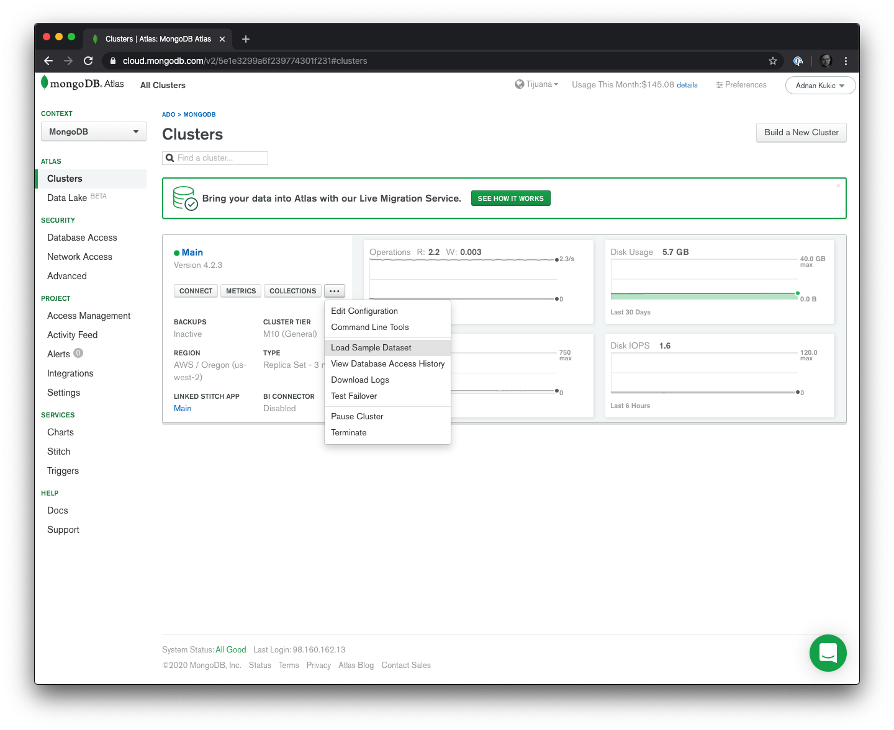
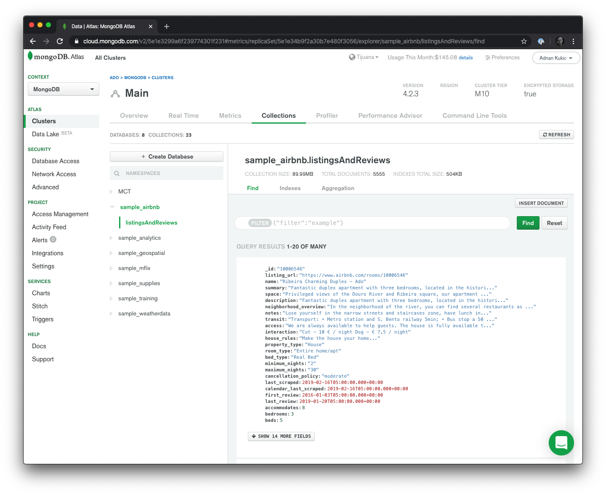
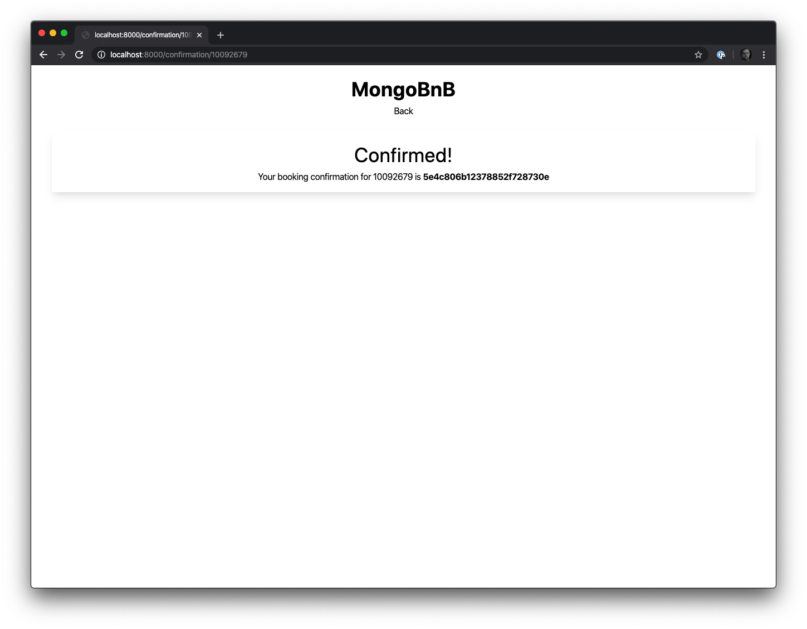
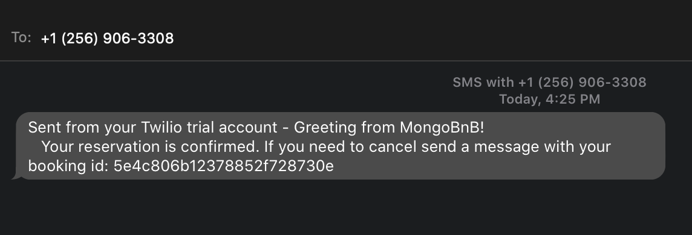
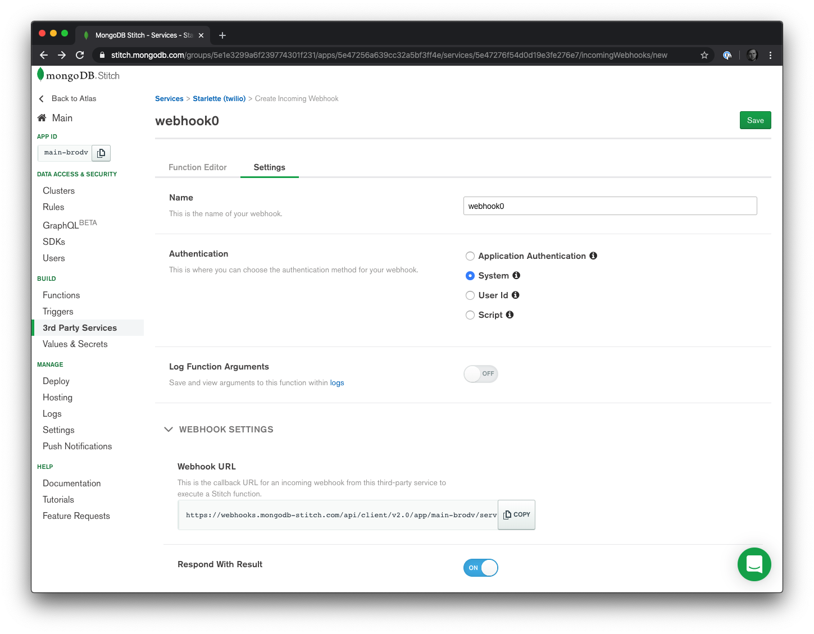
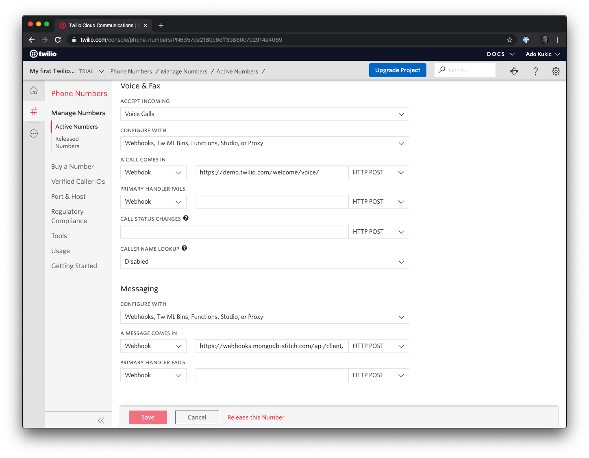

# Building a Property Booking Website with Starlette, MongoDB, and Twilio
As developers we often have the ability to choose our own tools to get the job done. If you're like me, any time a new framework builds up a reputation for high performance, you jump right in to see what the developer experience is like. In today's article, I want to look at building a web application with a Python ASGI framework called [Starlette](https://www.starlette.io/) that promises blazing fast performance and developer productivity. We'll put Starlette to the test by integrating [MongoDB](https://www.mongodb.com/atlas), [Stitch](https://www.mongodb.com/stitch), and [Twilio](https://twilio.com) into the mix to build an AirBnB-type property booking application.

If you would like to follow along with this tutorial, you can get the code from the [GitHub repo](https://github.com/kukicado/building-a-reservation-site-with-python-starlette-mongodb-and-stitch). Also, be sure to sign up for a [free MongoDB Atlas account](https://www.mongodb.com/atlas) to make it easier to connect your MongoDB database. Use code **ADO200** to receive a $200 credit. In this tutorial, we'll make use of a sample dataset that is provided by MongoDB Atlas.

## What is Starlette

[Starlette](https://www.starlette.io/) is a Python ASGI framework that shines. It is a farily new framework but has already garnered the attention of many Python developers for its high performance, support for [WebSockets](https://developer.mozilla.org/en-US/docs/Web/API/WebSockets_API), [GraphQL](https://graphql.org/), impressive 100% test coverage, and zero hard dependencies.


The framework is very light and easy to work with. The really impressive thing about Starlette is that it can be treated either as either an entire framework, or just a toolkit, where components can be independently utilized in your existing framework or application. For this tutorial, we'll treat Starlette as a framework and build our entire application with Starlette. For this tutorial, I'll assume you are familiar with Python, but if you need a refresher, there's no better place than the [official Python tutorial](https://docs.python.org/3/tutorial/).

## Today's Project: MongoBnB

Today we are going to be building a rental reservation system, similar to AirBnB, that we'll convinently name MongoBnB. Our application will display a list of featured properties, allow the user to sort by various parameters, view additional details of a selected property, and finally book and cancel reservations.


We have a lot to do today, so let's dive right into it!

## Building Our Dataset

As I mentioned at the beginning of this article, we are going to use a sample dataset provided by MongoDB Atlas. If you don't already have an account, [sign up for free here](https://www.mongodb.com/atlas) (and use code **ADO200** for a $200 credit), and create a new cluster. Once you have a cluster up and running, whether it'd be new or existing, load the sample dataset by clicking on the three dots button to see additional options, and then select "Load Sample Dataset."



The sample dataset provided by MongoDB Atlas will create a number of collections containing various  datasets. Navigate to the **Collections** tab to see them all. All of the datasets will be created as separate databases prefixed with `sample_` and then the name of the dataset. It may take a few minutes for all of the databases to be imported, but the one we care about for our application is called `sample_airbnb`. Open this database up and you'll see one collection called `listingsAndReviews`. Click on it to see the data we will be working with.



This collection will have over 5,000 documents, with each containing all the information we could ever want for a particular listing. For our application, we'll only work with a subset of the data, but you will have lots of existing data to expand on in case you wish to add additional features beyond the scope of the tutorial. Look around the dataset and familiarize yourself with it a little bit. Run a few filter queries such as `{"price": {"$lt":10}}` or `{"review_scores.review_scores_rating":100}` to find some really affordable properties or some of the highest rated ones respectively.

Now that we have our dataset ready, let's get to writing some Python.

## Setting Up Our Starlette Application

To get started with Starlette, we'll need to install it. Python's [pip pacakge manager](https://pip.pypa.io/en/stable/) can help with this. Open up your terminal and run the command `pip3 install starlette`. Starlette by itself is not a server so we'll need to install an ASGI server as well. There's many options like [uvicorn](http://www.uvicorn.org/), [daphne](https://github.com/django/daphne/), or [hypercorn](https://pgjones.gitlab.io/hypercorn/), and for our tutorial we'll use uvicorn. If you don't already have uvicorn installed, run the command `pip3 install uvicorn` and we'll be off to the races.

While we're installing dependencies, let's install one final one that we'll need for our application and that is [Jinja](https://palletsprojects.com/p/jinja/). Jinja is a templating engine for Python that we'll use to render our application to the browser. Run `pip3 install jinja2` to install it. This is an optional dependency for the Starlette framework, if you're just planning on using Starlette to serve an API with JSON responses for example, then you could omit this step, but for our tutorial, we'll make use of it.

## Hello Starlette

Now that we have our dependencies installed, we're ready to write some code. Create a new python file called `app.py`. This will be our main entry point into our Starlette application. To get started, let's setup the most basic Starlette application to ensure that all of our dependencies were installed correctly. Write the following code:

```py
from starlette.applications import Starlette
from starlette.routing import Route
from starlette.responses import PlainTextResponse

async def homepage(request):
  return PlainTextResponse("Hello from Starlette")

app = Starlette(debug=True, routes=[
    Route('/', homepage),
])
```

The code above imports the Starlette framework, or various toolkit components if you will, such as routing and responses. Then on line 8 we create an instance of our Starlette application. For our app we'll want the debugging to be on so we have detailed error reports, and for the second parameter we pass in our routes. For this test app, we're only going to have one route and we'll call it `homepage`. Finally, we implement this homepage route and all it does is display the message "Hello from Starlette" to the users browser.

Let's make sure our app works. Since we installed uvicorn as our ASGI server, we'll use it to start up our application. In the terminal exceute the command `uvicorn app:app` in the directory where your `app.py` file resides. This will start up the default server on `localhost:8000`. You will get a message in the terminal saying that the Uvicorn server is running if everything went ok, if you have issues at this point, ensure that all of the above pip packages are installed. Check out the [uvicorn docs page](https://www.uvicorn.org/) for troubleshooting.

If all went well and the server is up and running, navigate to `localhost:8000` in your browser and you'll see the message "Hello from Starlette." Congrats! You just built your first Starlette application. Now let's build something real.

## Architecting MongoBnB

We have a basic Starlette app up and running, now let's expand on it for our tutorial application. While we certinly could add all of our code in this single `app.py` file, that wouldn't be an ideal developer experience. So let's define our requirements and break up our application into multiple files. 

We know we'll have multiple routes, so let's create a `routes.py` file to house them. Our routes will communicate with our database and rather than creating a connection to our cluster in each route, we'll create a connection pool and pass it down as middleware, so let's also create a `middleware.py` file. Next, as we saw in our dataset, we won't work with the entire document, so let's also create a `models.py` file that will hold our models. Finally, it looks like we're building an [MVC](https://en.wikipedia.org/wiki/Model%E2%80%93view%E2%80%93controller) type application where we have models, our routes are our controllers, so let's add a `templates` directory, that will hold our views.

Now that we have our templates directory created, let's decide on what our application will do. Our app will have three different views:

* A homepage that displays listings
* A listings page that displays additional details on a particular property
* A confirmation page that is displayed when a user *books* a property

In the `templates` directory, let's create a `index.html`, `listing.html`, and `confirmation.html` file for our three views. In each of the files, let's just create a skeleton of the page we'll want to render.

```html
<html>
<head>
    <title>MongoBnB | Home</title>
    <link href="https://unpkg.com/tailwindcss@^1.0/dist/tailwind.min.css" rel="stylesheet">
</head>
<body>
  <h1>Home!</h1>
</body>
</html>
```

Repeat for both the `listing.html` and `confirmation.html` pages. Notice that we're also bringing in [TailwindCSS](https://tailwindcss.com/). Tailwind will allow us to better style our pages without writing a bunch of custom CSS.


Since we have our skeleton views created, let's open up the `routes.py` file and hook up our views to our controllers. In the `routes.py` file, add the following code:

```py
from starlette.templating import Jinja2Templates

templates = Jinja2Templates(directory='templates')

async def homepage(request):
    return templates.TemplateResponse('index.html', {'request': request})

async def listing(request):
    return templates.TemplateResponse('listing.html', {'request': request})

async def confirmation(request):
    return templates.TemplateResponse('confirmation.html', {'request': request})
```

In the code above, we are importing Jinja2 templates and setting the default directory where our views will reside. Then, we create three async functions for our three controllers. At the moment we are not doing any logic, we're just serving up static html content. The final piece of the puzzle will be hooking up these new routes to our Starlette application. Open up `app.py` and make the following adjustments to the codebase:

```py
from starlette.applications import Starlette
from starlette.routing import Route
from routes import homepage, listing, confirmation

app = Starlette(debug=True, routes=[
    Route('/', homepage),
    Route('/listing/{id}', listing),
    Route('/confirmation/{id}', confirmation),
])
```

We are replacing our default routing with the new routes we created in the `routes.py` file. Restart the uvicorn server and try navigating to `localhost:8000`, `localhost:8000/listing/1`, and `localhost:8000/confirmation/1` and all three of these routes should load and display the message you created earlier.

## Connecting Starlette to MongoDB

Name a more iconic duo than Python and [SQLAlchemy](https://www.sqlalchemy.org/). Fortunately, Starlette is not opinionated about which database technology you should work with and doesn't prefer SQL over NoSQL. For our tutorial, since we have our dataset in MongoDB Atlas, we'll use Mongo and the excellent [pymongo package](https://api.mongodb.com/python/current/). 

If you don't already have pymongo installed, do so now by running `pip3 install pymongo`. Once pymongo is installed open up the `middleware.py` file we created earlier. Here is where we'll instantiate our connection to MongoDB so that we can interact with the dataset and populate our application with real data.

```py
from starlette.middleware import Middleware
from starlette.middleware.base import BaseHTTPMiddleware
import pymongo
import ssl

class DatabaseMiddleware(BaseHTTPMiddleware):
    async def dispatch(self, request, call_next):
        client = pymongo.MongoClient("{YOUR-CONNECTION-STRING}", ssl_cert_reqs=ssl.CERT_NONE)
        db = client["sample_airbnb"]
        request.state.db = db
        response = await call_next(request)
        return response

middleware = [
    Middleware(DatabaseMiddleware)
]
```

The code above will create a new middleware function called `DatabaseMiddleware`. This function will use pymongo to establish a connection to our MongoDB Atlas cluster. Next, we'll want to connect just to our `sample_airbnb` database. Before the result of this function is passed down to the individual controller, we'll add a new state variable named `db` to our request and send it down to the next middleware or the final controller function. In our case, we'll only have this one middleware function that gets executed.

Now that we have our middleware function defined, we'll create a new instance of Middleware, pass in our newly created `DatabaseMiddleware` and store it in a middleware variable. To use this middleware in all of our routes, we'll open up `app.py` and make the following adjustments to our Starlette instantiation:

```py
from starlette.applications import Starlette
from starlette.routing import Route
from middleware import middleware
from routes import homepage, listing, confirmation

app = Starlette(debug=True, routes=[
    Route('/', homepage),
    Route('/listing/{id}', listing),
    Route('/confirmation/{id}', confirmation),
], middleware=middleware)
```

With the middleware in place, we are ready to start implementing our controller functions. This middleware will now execute for all of our functions. We could get granular and pass it only for specific routes, but since all of our routes will be talking to the database, it makes sense to apply this middleware globaly. We will be able to access our database in each route via `request.state.db`.

## Defining our Data Model

We know what our data model looks like in MongoDB, but our Starlette application does not. For this app, we'll only have one model, but we need to define it. Open up `models.py` and add the following code:

```py
class Property():
    def __init__(self, id, name, summary, address, price, cleaning_fee, guests, image, amenities):
        self.id = id
        self.name = name
        self.summary = summary
        self.address = address
        self.price = price
        self.cleaning_fee = cleaning_fee
        self.guests = guests
        self.image = image
        self.amenities = amenities
```

This code will allow us to create instances of a property that contain only a subset of all the data we get back from our MongoDB database.

## Implementing the Homepage

We have all the groundwork done, now we can implement our controllers. The first one we'll tackle is the homepage. Open up `routes.py` and add the following code:

```py
from starlette.templating import Jinja2Templates
from models import Property

async def homepage(request):
    data = request.state.db.listingsAndReviews.find({'cleaning_fee':{'$exists': True}}, limit=15)

    response = []

    for doc in data:
        response.append(
            Property(
                doc['_id'],
                doc['name'], 
                doc['summary'], 
                doc['address']['street'], 
                str(doc['price']), 
                str(doc['cleaning_fee']),
                str(doc['accommodates']),
                doc['images']['picture_url'],
                doc['amenities']
            )
        )
    
    return templates.TemplateResponse('index.html', {'request': request, 'response': response})
```

Let's break down the code we added for the homepage so far. On the first line we are using the `request.state.db` property passed down from the middleware which contains our MongoDB connection. We are going into the `listingsAndReviews` collection and running a `find()` operation. We want to return 15 properties and the only filter we're applying is that a `cleaning_fee` property must exist on the document. 

Once this executes we will receive a Cursor that contains our data. Next we'll iterate over that Cursor and create new instances of the Property class for each document in the cursor. Each Property will then be appended in a response list, and this response list will be sent alongside our request to our Jinja template where we'll have access to all the data.

Let's return to our `index.html` file now and update it with the actual UI we want to build.

```html
<html>
<head>
    <title>MongoBnB | Home</title>
    <link href="https://unpkg.com/tailwindcss@^1.0/dist/tailwind.min.css" rel="stylesheet">
</head>
<body>

    <div class="container mx-auto">
      <div class="flex">
          <div class="row w-full text-center my-4">
              <h1 class="text-4xl font-bold mb-5">MongoBnB</h1>
          </div>
      </div>
      <div class="flex flex-row flex-wrap">
      
        <div class="flex-auto w-1/4 rounded overflow-hidden shadow-lg m-2">
            
            <div class="px-6 py-4">
                <div class="font-bold text-xl mb-2">{{ property.name }} (Up to {{ property.guests }} guests)</div>
                <p>{{ property.address }}</p>
                <p class="text-gray-700 text-base">
                    {{ property.summary }}
                </p>
            </div>

            <div class="text-center py-2 my-2 font-bold">
                <span class="text-green-500">${{ property.price }}</span>/night (+<span class="text-green-500">${{ property.cleaning_fee }} </span>Cleaning Fee)
            </div>

            <div class="text-center py-2 my-2">
                <a href="/listing/{{property.id}}" class="bg-blue-500 hover:bg-blue-700 text-white font-bold py-2 px-4 rounded">Details</a>
                <a href="/confirmation/{{property.id}}" class="bg-green-500 hover:bg-green-700 text-white font-bold py-2 px-4 rounded">Book</a>
            </div>
        </div>
      
      </div>
    </div>
</body>
</html>
```

Save both the `index.html` file and the `routes.py` file. Restart the uvicorn server and navigate to `localhost:8000`. The result displayed should look like the image below:


Excellent! Our homepage is looking good. It's showing 15 results that are coming from the MongoDB database. Clicking on **Details** or **Booking** just takes you to an empty HTML page for now, but that's ok, we're not there yet. Before we implement those, let's also add some filters to our homepage to help our visitors discover additional properties.

In the `index.html` page add the following code underneath the `<h1 class="text-4xl font-bold mb-5">MongoBnB</h1>` tag:

```html
<div class="inline-flex">
    <a href="/" class="bg-gray-300 hover:bg-gray-400 text-gray-800 font-bold py-2 px-4 rounded-l">
      Featured
    </a>
    <a href="/?filter=under-100" class="bg-gray-300 hover:bg-gray-400 text-gray-800 font-bold py-2 px-4 rounded-r">
      Under 100
    </a>
    <a href="/?filter=highly-rated" class="bg-gray-300 hover:bg-gray-400 text-gray-800 font-bold py-2 px-4 rounded-r">
        Highly Rated and Cheap
    </a>
    <a href="/?filter=surprise" class="bg-gray-300 hover:bg-gray-400 text-gray-800 font-bold py-2 px-4 rounded-r">
        Surprise Me
    </a>
</div>
```

What this will do is pass a query parameter called `filter` with a pre-defined filter. The filters will be for properties under $100, highly rated properties, and a suprrise that you can implement yourself. Let's open up our `routes.py` filter and edit the `homepage` route to support these filters.

```py
async def homepage(request):
    try:
        filter = request.query_params['filter']

        if filter == 'under-100':
            data = request.state.db.listingsAndReviews.find({'$and':[{'cleaning_fee':{'$exists': True}},{'price': {'$lt': 100}}]}, limit=15)
        elif filter == 'highly-rated':
            data = request.state.db.listingsAndReviews.find({'$and':[{'cleaning_fee':{'$exists': True}},{'price': {'$lt': 100}},{'review_scores.review_scores_rating': {'$gt': 90}}]}, limit=15)
        elif filter == 'surprise':
            data = request.state.db.listingsAndReviews.find({'cleaning_fee':{'$exists': True},'amenities': {'$in': ["Pets allowed", "Patio or balcony", "Self check-in"]}}, limit=15)
    except KeyError:
        data = request.state.db.listingsAndReviews.find({'cleaning_fee':{'$exists': True}}, limit=15)

    response = []

    for doc in data:
        response.append(
            Property(
                doc['_id'],
                doc['name'], 
                doc['summary'], 
                doc['address']['street'], 
                str(doc['price']), 
                str(doc['cleaning_fee']),
                str(doc['accommodates']),
                doc['images']['picture_url'],
                doc['amenities']
            )
        )
    
    return templates.TemplateResponse('index.html', {'request': request, 'response': response})
```

Our homepage now supports multiple different filters. If a user visits just the homepage, they'll see the original results, but clicking on of the filter buttons will return a different set of results depending on the type of filter selected. Pymongo supports all of MongoDB's filtering functionality in the familiar syntax. Check out the examples above for various ways to write filters.


Make the changes above, restart your uvicorn server, and navigate to `localhost:8000` to see the results.

## Building the Listing Page

Our homepage contains a lot of information on multiple properties. The listing page will contain additional information on the selected property. Open up the `routes.py` file and update the listing definition to as follows:

```py
async def listing(request):
    id = request.path_params['id']

    doc = request.state.db.listingsAndReviews.find_one({'_id': id})

    response = Property(
                doc['_id'],
                doc['name'], 
                doc['summary'], 
                doc['address']['street'], 
                str(doc['price']), 
                str(doc['cleaning_fee']),
                str(doc['accommodates']),
                doc['images']['picture_url'],
                doc['amenities']
            )

    return templates.TemplateResponse('listing.html', {'request': request, 'property': response})
```

Here we are utilizing the `request` object to get the `id` of the property we wish to see extra details for. From there, we run a `find_one` method that returns just a single document from our MongoDB database. Finally, we take our document and transform it to a new Property class and send it to our template via the `property` variable.

Open up `listing.html` and update the content to:

```html
<html>
<head>
    <title>MongoBnB | Property - {{ request.path_params['id'] }}</title>
    <link href="https://unpkg.com/tailwindcss@^1.0/dist/tailwind.min.css" rel="stylesheet">
    <style>
      img {
          width: 500px !important;
          margin: 0 auto;
      }
    </style>
</head>
<body>

    <div class="container mx-auto">
        <div class="flex">
            <div class="row w-full text-center my-4">
                <h1 class="text-4xl font-bold">MongoBnB</h1>
                <a href="/">Back</a>
            </div>
        </div>
        <div class="flex flex-row flex-wrap">
    
    <div class="flex-auto w-1/4 rounded overflow-hidden shadow-lg m-2">
        
        <div class="px-6 py-4">
            <div class="font-bold text-xl mb-2">{{ property.name }} (Up to {{ property.guests }} guests)</div>
            <p>{{ property.address }}</p>
            <p class="text-gray-700 text-base">
                {{ property.summary }}
            </p>

        </div>
        <div class="px-6 py-4">
            
            <span class="inline-block bg-gray-200 rounded-full px-3 py-1 text-sm font-semibold text-gray-700 m-1">{{ amenity }}</span>
            
        </div>

        <div class="text-center py-2 my-2 font-bold">
            <span class="text-green-500">${{ property.price }}</span>/night (+<span class="text-green-500">${{ property.cleaning_fee }} </span>Cleaning Fee)
        </div>

        <div class="text-center py-2 my-2">
            <a href="/confirmation/{{property.id}}" class="bg-green-500 hover:bg-green-700 text-white font-bold py-2 px-4 rounded">Book</a>
        </div>
    </div>
        </div>
    </div>
</body>
</html>
```

Save both of the files, restart your server, and navigate to `localhost:8000`. Click on the **Details** button of any property you wish to see expanded information on. The page should look like this:


## Booking Confirmation Page

Finally, we'll implement the booking confirmation page. This will be a simple UI, but on the backend, we'll do something we haven't done yet, which is **save data to our MongoDB database**. Open up the `routes.py` file and add the following implementation for the confirmation route:

```py
async def confirmation(request):
    id = request.path_params['id']

    doc = request.state.db.bookings.insert({"property": id})

    return templates.TemplateResponse('confirmation.html', {'request': request, 'confirmation': doc})
```

Like in the previous route, we are making use of route parameters to capture the `id` of the booking. We are then using `request.state.db` to access our MongoDB database, but now we are accessing the `bookings` collection, which does not exist. That's ok, MongoDB will create a bookings collection for us in the `sample_airbnb` database, and since we are using insert, we'll add a document that has one attribute called `property` and we'll set it to the id of the listing.

Since we are not creating one ourselves, MongoDB will automatically create an `_id` attribute for us, and that's what will be returned and stored in the `doc` variable, that we'll pass to our template.

Open up `confirmation.html` and add the following UI code:

```html
<html>
<head>
    <link href="https://unpkg.com/tailwindcss@^1.0/dist/tailwind.min.css" rel="stylesheet">
    <style>
    </style>
</head>
<body>

    <div class="container mx-auto">
        <div class="flex">
            <div class="row w-full text-center my-4">
                <h1 class="text-4xl font-bold">MongoBnB</h1>
                <a href="/">Back</a>
            </div>
        </div>
        <div class="flex flex-row flex-wrap">
    
    <div class="flex-auto w-1/4 rounded overflow-hidden shadow-lg m-2">
        <div class="px-6 py-4 text-center">
            <h1 class="text-4xl">Confirmed!</h1>
            <p>Your booking confirmation for {{request.path_params['id']}} is <span class="font-bold">{{confirmation}}</span></span></p>
        </div>
    </div>
        </div>
    </div>
</body>
</html>
```

We are treating our unique `_id` property as the confirmation code for the booking. Restart the server and go ahead and book a property! You should see the following UI:



## Handling The Bookings

Our Starlette application is complete. We show our users properties they may be interested in, allow them to drill down and view more information, and book the perfect property for their stay. But what if we wanted to go an extra step and add some more functionality?

Here's what I'm thinking. Once a user books their stay, why don't we send them a text message confirming their booking. Knowing that our visitors are likely on the move, why don't we also allow them to cancel their booking by replying to the initial text message in case they change their mind? We're all about giving our users a great experience after all!

To do this we'll make use of the [MongoDB Stitch](https://mongodb.com/stitch) platform. Stitch is a serverless platform that integrates into MongoDB and gives us a plethora of functions, triggers, 3rd party service integrations and more. Since we're talking about texting our users, I think it makes sense to use Stitch's [Twilio](https://twilio.com) integration.

## Setting up MongoDB Stitch

To create a new MongoDB Stitch application, we'll go into our MongoDB Atlas dashboard. Select **Stitch** from the left-hand menu and click the **New Application** button. Give your application a name, link it to your cluster that has the `sample_airbnb` database and hit **Create**. MongoDB Atlas will take a few seconds to set up your Stitch application and redirect you to it.


Once the MongoDB Stitch dashboard loads up, select **3rd Party Services** from the menu and then **Twilio**. Here you will be asked to name your Twilio service for Stitch as well as provide your Twilio Account SID. You will need an active Twilio account to get the Account SID, and if you don't have one head on over to [Twilio](https://twilio.com) to sign up and create your account.

Now that we have our Twilio service created, select the **Functions** menu item. Click the **Create New Function** button, name your function and for the settings you can leave all the defaults, but navigate to the **Function Editor** tab and add the following code:

```js
exports = function(arg){
  const twilio = context.services.get("Starlette"); //The name of your Twilio service
  const args = {
    to: "+19999999999", // The phone number you want the SMS to send to
    from: "+19999999999", // Your Twilio phone number
    body: `Greeting from MongoBnB!
    Your reservation is confirmed. If you need to cancel send a message with your booking id: ${arg.fullDocument._id}`
  };
  twilio.send(args);
  return {arg: arg};
};
```

This function will send the user an SMS text message when a new booking is created. For this tutorial, we'll just send the text message to a predetermined phone number, and I'll leave it to you as homework to figure out how to add a user-defined phone number.

Save the function. By default this function will never be called. We have to create a trigger to activate it. Navigate to the **Triggers** section of the Stitch dashboard. Hit the **Add a Trigger** button and make the following selections:

* **Name** - name the function whatever you want
* **Cluster Name** - this will default to the cluster you selected when creating the Stitch application
* **Datbase Name** - be sure to select `sample_airbnb`
* **Collection Name** - be sure to select `bookings`
* **Operation Type** - be sure to select only **Insert**
* **Full Document** - set to **On**
* **Function** - select the name of the function you created above

Once these settings are in place hit the **Save** button.


Now our serverless function should be ready to go. Hit the **Review & Deploy Changes** button in the top blue bar. Once the changes are deployed, go back to your Starlette application on `localhost:8000`. 

Select a booking that pleases you and click on the **Book** button. Immedetly you will see the confirmation page we built earlier, but in a few seconds, you will also receive a text message telling you that the booking has been created.



## Handling Incoming Twilio SMS with MongoDB Stitch

Our final piece of functionality in MongoDB Stitch will be to allow the user to send us the confirmation id in the event they want to cancel their booking. To do this, let's naviagte back to **3rd Party Services** and click our Twilio service we created earlier. From here, we'll click on the **Add Incoming Webhook** button.



We can leave all the default settings as is but what we'll want to take note of on this page is the **Webhook URL**. Copy it and save it as we'll need it in just a few minutes. Navigate to the **Function Editor** tab and add the following code:

```js
exports = function(payload) {
  const mongodb = context.services.get("main"); // The name of your MongoDB cluster
  const bookings = mongodb.db("sample_airbnb").collection("bookings");
  
  bookings.deleteOne({_id: new BSON.ObjectId(payload.Body)})
  
  const twilio = context.services.get("Starlette"); // The name of your Twilio service
  const args = {
    to: "+19999999999", // The number to send the SMS message to
    from: "+19999999999", // Your Twilio number
    body: `Reservation ${payload.Body} has been cancelled. See you next time!`
  };
  twilio.send(args);
  return payload.Body
};
```

This function will take the body of the SMS message, which for all intents and purposes we'll assume to just be the reservation `_id`, and if it is, we'll go into our `bookings` collection and delete that record. Once that is done, we'll respond back to the user telling them that their reservation has been cancelled.


This function won't fire automatically though. To get it to work, we'll need to tell Twilio about our function. Log into your Twilio dashboard and navigate to the **Phone Numbers** service. Select the phone number you wish to use and scroll the the bottom of the page to find the **Messaging** settings. In the **A Message Comes In** setting, from the drop down select **Webhook** and for the value paste in your MongoDB Stitch Webhook URL we saved from earlier. That's it. Now it should all work!



## Putting It All Together

In today's tutorial we learned about Starlette, an ASGI framework for building performant Python applications. We connected our Starlette application to a MongoDB database hosted by MongoDB Atlas. Finally, we enhanced our application using MongoDB Stitch, a serverless platform made for MongoDB, by adding Twilio SMS functionality. I hope you found this tutorial helpful. If you would like to clone the completed code, you can get it from [GitHub]. Be sure to[sign up for MongoDB Atlas](https://www.mongodb.com/download-center) (and use code **ADO200** to get $200 in credits) as it will give you access to the dataset for the tutorial. Happy coding!